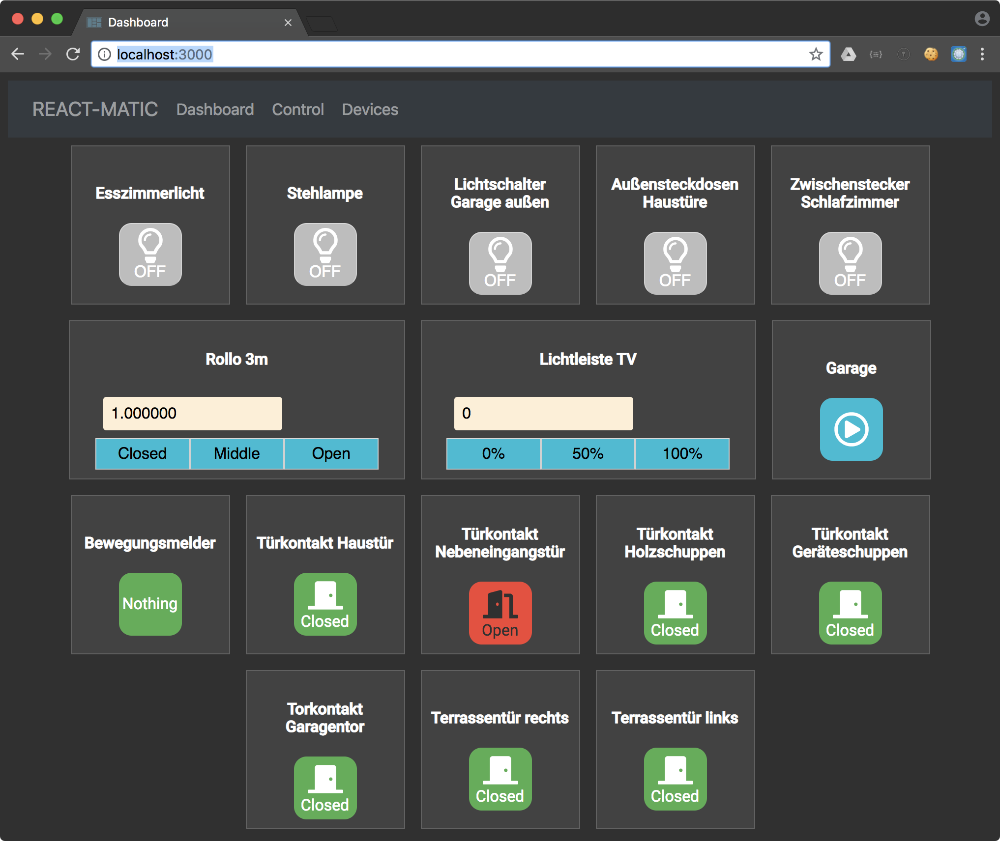

<h1 align="center">
  React-Matic
</h1>

## Table of Contents

* [Installation](#installation)
* [Server](#server)
  * [Development](#development)
  * [Production](#production)
  * [Docker](#docker)
* [Available Themes](#available-themes)
  * [light](#light)
  * [dark](#dark)
* [License](#license)

## Environment
Sample .env file
```
WEBCAM_USER=WEBCAM HTTP USER
WEBCAM_PASS=WEBCAM HTTP PASSWORD
WEBCAM_IMAGE_URL=e.g. http://192.168.178.777/image/jpeg.cgi
OSRAM_GATEWAY_BASE_IP=YOUR OSRAM GATEWAY IP e.g. 192.168.178.777
APP_BASE_URL=http://localhost:3000
OPEN_WEATHER_MAP_API_KEY=YOUR_OPENWEATHER_API_KEY
```

## Installation

1. [Download](../../archive/master.zip) or clone the repository.
2. Install the dependencies with `yarn`.

## Server

### Development

Run `yarn dev` and go to http://localhost:3000.

### Production

Build your React-Matic for production with `yarn build` and then start the
server with `yarn start`.

### RPi

#### setup rspi
- first install raspian OS - https://www.raspberrypi.org/documentation/installation/installing-images/
- activate SSH access - https://www.google.com/search?q=raspbian+activate+ssh&oq=raspian+ac&aqs=chrome.1.69i57j0l5.4483j1j7&sourceid=chrome&ie=UTF-8
- install docker - https://maker-tutorials.com/docker-raspberry-pi-installieren-raspbian-debian-stretch-jessie/
```bash
curl -fsSL get.docker.com -o get-docker.sh && sh get-docker.sh
```
- install tools
```bash
curl -sL https://deb.nodesource.com/setup_8.x | sudo -E bash - 
sudo apt-get install nodejs 
curl -o- -L https://yarnpkg.com/install.sh | bash 
```
- clone project
```bash
git clone https://github.com/michl-b/react-matic.git
```

#### build & run container
1. go to your app working directory and run the following commands.
2. create .env file
```bash
nano .env
```
3. pull, build and run container
```bash
git pull && yarn --network-timeout 1000000 && yarn build && sudo docker build -t react-matic . && sudo docker stop reactMatic || true && sudo docker run --name reactMatic --rm -d -p 3000:3000 react-matic
```

### Docker

1. Build your React-Matic for production with `yarn build`
2. Build the image with `docker build -t react-matic .`
3. Start the container with `docker run -d -p 8080:3000 react-matic`
4. Go to http://localhost:8080

## API
### Osram
#### All devices
GET /api/osram/discover
curl -X GET 'http://localhost:3000/api/osram/discover'

#### node status
GET /api/osram/nodeStatus?mac={mac or friendlyMac}
curl -X GET 'http://localhost:3000/api/osram/nodeStatus?mac=e1ffa200aa3eb07c'

#### set node On/Off
GET /api/osram/nodeOnOff?mac={mac or friendlyMac}&on=0/1
curl -X GET 'http://localhost:3000/api/osram/nodeOnOff?mac=e1ffa200aa3eb07c&on=0'
curl -X GET 'http://localhost:3000/api/osram/nodeOnOff?mac=e1ffa200aa3eb07c&on=1'

#### set node Brightness
GET /api/osram/nodeBrightness?mac={mac or friendlyMac}&brightness=[0-100]
curl -X GET 'http://localhost:3000/api/osram/nodeBrightness?mac=e1ffa200aa3eb07c&brightness=50'

#### set node Color
GET /api/osram/nodeColor?mac={mac or friendlyMac}&red=[0-255]&green=[0-255]&blue=[0-255]
curl -X GET 'http://localhost:3000/api/osram/nodeColor?mac=e1ffa200aa3eb07c&red=255&green=0&blue=0'
curl -X GET 'http://localhost:3000/api/osram/nodeColor?mac=e1ffa200aa3eb07c&red=0&green=255&blue=0'
curl -X GET 'http://localhost:3000/api/osram/nodeColor?mac=e1ffa200aa3eb07c&red=0&green=0&blue=255'

## Available Themes

### [light](./styles/light-theme.js)

#### Example

```javascript
import lightTheme from '../styles/light-theme'

<Page theme={lightTheme}>
  ...
</Page>
```

#### Preview


### [dark](./styles/dark-theme.js)

#### Example

```javascript
import darkTheme from '../styles/dark-theme'

<Page theme={darkTheme}>
  ...
</Page>
```

#### Preview



## License

Copyright (c) 2018 Michael Bartsch. See [LICENSE](./LICENSE.md) for details.
